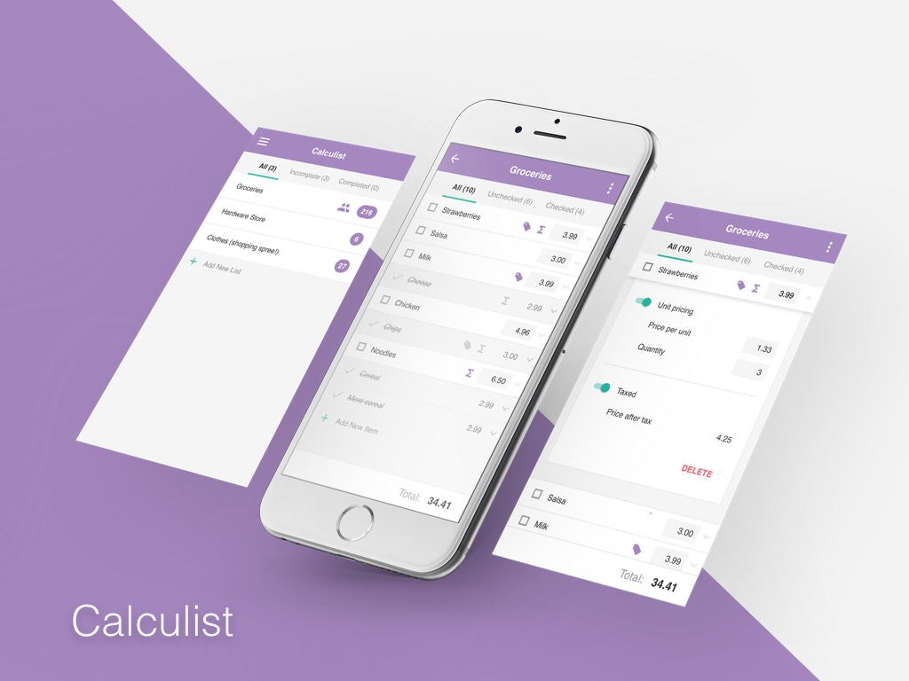

# Calculist (client-side) #
Your in-store shopping cart total. Know what you're spending before you spend it.

## Requirements ##
This repository contains the client-facing app, and needs the server-side repository in order to run locally. You can download the server code [here](https://github.com/stuffmattdoes/react-calculist-server).

Your development environment needs the following software installed:

* [Node.js & NPM](https://nodejs.org/en/)

## The Tech Stack ##
* [React](https://facebook.github.io/react/) - *(Javascript)* a front-end library responsible for dynamically rendering components
* [React Router](https://github.com/ReactTraining/react-router) - *(Javascript)* handles dynamic URLs and routing on the client environment. Integrates with the browser history API, which is pretty sweet.
* [The Flux Pattern](https://github.com/facebook/flux/tree/master/examples/flux-concepts) - *(Javascript)* a methodology on how to architect the flow of data throughout your app.

## Setup ##
Run the following commands in terminal/console in order to get setup locally:

1. `npm install` to install all development dependencies
2. `webpack` to compile static files, such as CSS and the classic Webpack Javascript bundle.

## Development ##
As mentioned above, you'll need the server side code repository in order to run this web app on your local machine.

Run the following commands in terminal/console in order to develop locally:

1. ` cd /path/to/server-code && npm start` to spin up our local server environment. This will handle all API calls we make locally.
2. `cd /path/to/client-code && npm start` to start up our dev server & asset watcher, which will serve as our local static file server.
2. Dev away!

## Deployment ##
You shouldn't be deploying my code! But if you must know, I host the this client-side portion of the app on my own Digital Ocean droplet at [calculist.stuffmattdoes.com](https://calculist.stuffmattdoes.com). Head over there to register and shop on a budget!

## Roadmap ##
This app is in active development. To see a list of planned features, check out my [Calculist Trello board](https://trello.com/b/ZQUkXrIX/calculist).

## Personnel ##
<<<<<<< HEAD
[Matthew Morrison](m.james.morrison00@gmail.com) - literally everything
=======
[Matthew Morrison](m.james.morrison00@gmail.com) - literally everything
>>>>>>> develop
